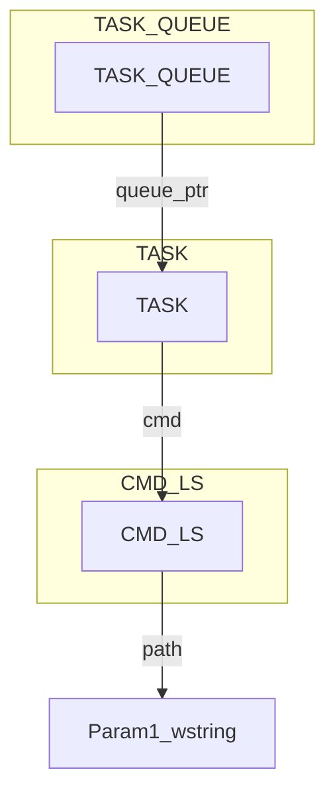

## Introduction

This article will begin the discussion of the individual components that make up Hannibal.

## A Note On Stardust

Before we begin exploring Hannibal, we need to understand the PIC template that was used. I suggest reading the original blog post on [Stardust](https://5pider.net/blog/2024/01/27/modern-shellcode-implant-design/). Briefly, the template will do the following:

### Stardust Building

- Define various sections to place code in.
- Use a linker script to order them and place in the .text section.
- Compile and link.
- Use a python script to extract the .text section. (this is our PIC bin)

### Stardust Execution

- Places a struct containing pointers, agent info, etc on the heap
- We access this pointer relative to the start of the agent throughout. This enables a global variable of sorts without needing to pass as an arg everywhere.

For even more information I'd suggest reading [Executing Position Independent Shellcode from Object Files in Memory](https://bruteratel.com/research/feature-update/2021/01/30/OBJEXEC/) as it covers some of the same concepts.


## Agent Architecture

There are endless ways to design a C2 agent, but they will generally have several components that are common across all of them. 


- Sleep Cycle
- Execution Loop
- Post-Ex Extensibility
- Network Communications Protocol
- Command Queue, Execution, Response

These vary greatly and the level of abstraction is arbitrary, but this is a very high-level summary.


## Hannibal Systems

These are implemented in Hannibal:

- Sleep
- Checkin Loop
- Execution Loop
- Task Queue
- Task Response Queue
- File Download Queue
- File Upload Queue
- HTTP Network Communications with custom TLV binary protocol.

We will look at a few of these to get a feel for the reasoning behind the implementation. The code was written in a way to attempt to make it self-explanatory, and will convey more details than this article.

The core of Hannibal is **src/hannibal.c**. Config is read in from **include/config.h** and set here. Then the checkin and primary loops get called.

### Sleep

At the moment, Hannibal is using the original [Ekko](https://github.com/Cracked5pider/Ekko) POC for sleep obfuscation. I have not tested how it does for evasion.

It was selected as it was easiest to integrate with Hannibal. The [Havoc Framework](https://github.com/HavocFramework/Havoc/blob/main/payloads/Demon/src/core/Obf.c) has a much more refined version with various evasions in it.


If you are not familiar with sleep obfuscation techniques, see this [article](https://www.binarydefense.com/resources/blog/understanding-sleep-obfuscation/).


### Task Queuing

Task queues are implemented as a struct on the heap and tracked in the global instance struct. Their size is controlled in **include/hannibal_tasking.h**.

```c
#define TASK_CIRCULAR_QUEUE_SIZE 10
#define TASK_RESPONSE_CIRCULAR_QUEUE_SIZE 10
```

The task queue struct will point to an array of TASK structs which represent each task as it comes in from the controller.

Read **src/hannibal.c** to see where they're initialized. A task "type" was created because I wanted all cmds to accept only a single argument of the same type. This was in an attempt to follow loosely coupled principles. I want users to be able to change profiles without worrying about the args for cmds.

### Commands

Also in **include/hannibal_tasking.h** are typedefs for each command. They are intended to store the parameters you wish to pass to the command. For example lets go into the task deserialization function in **src/profile_mythic_http.c** and look at the ls cmd. This is the data that was serialized by translator.py.

```c
#ifdef INCLUDE_CMD_LS
            case CMD_LS_MESSAGE:
                
                ...

                if (tlv_type == TLV_CMD_LS_PARAM_PATH) {
                    param1_uint32 = ReadUint32(&buffer);
                    param1_wstring = ReadStringW(&buffer, param1_uint32); // Freed in cmd_ls()
                }

                ls = (CMD_LS *)task.cmd;
                ls->path = param1_wstring;
                task.cmd = ls;
                
                task_enqueue(hannibal_instance_ptr->tasks.tasks_queue, &task);

                break;
```
 
You'll notice instead of passing params direct into the command, a struct containing pointers to the params is stored in a TASK struct. This struct is then stored in the queue.




### Command Execution

In **src/hannibal.c**, hannibal_exec_tasks() loops through the task queue and executes each command.

```c
TASK exec_task;
task_dequeue(hannibal_instance_ptr->tasks.tasks_queue, &exec_task);

for(int j = 0; j < hannibal_instance_ptr->tasks.task_func_ptrs_size; j++){
    if(hannibal_instance_ptr->tasks.task_func_ptrs[j].cmd_id == exec_task.cmd_id){
        hannibal_instance_ptr->tasks.task_func_ptrs[j].cmd_ptr(exec_task);
```

These were initialized in **src/hannibal_tasking.c** as function pointers. We can see that each cmd has the same parameter.

This is the reason for the TASK typdef and how it was implemented. So we could loop through function pointers and pass in a single argument of the same type.

Now looking at the start of the command we simply indicate it is the CMD_LS struct and access the parameters we choose:

```c
SECTION_CODE void cmd_ls(TASK t)
{
    HANNIBAL_INSTANCE_PTR

    CMD_LS *ls = (CMD_LS *)t.cmd;
    ...
    if (pic_strlenW(ls->path) * sizeof(WCHAR) > MAX_PATH*sizeof(WCHAR)) {
        return;
    }

    pic_strcatW(szDir, ls->path);
```

### Task Responses

At the end of the ls command we see an example of queueing a response:

```c
TASK response_t;

response_t.output = (LPCSTR)response_content;
response_t.output_size = CURRENT_BUFFER_USAGE;
response_t.task_uuid = t.task_uuid;

task_enqueue(hannibal_instance_ptr->tasks.tasks_response_queue, &response_t);

hannibal_instance_ptr->Win32.VirtualFree(ls->path, 0, MEM_RELEASE);
hannibal_instance_ptr->Win32.VirtualFree(t.cmd, 0, MEM_RELEASE);
```

<blockquote class="prompt-warning">
  <p>
    There is something to note regarding the task responses. The commands encode all data as UTF-16. All types must be converted to wchar before being placed into the response buffer.
    The response buffer is effectively a single wide string with only one wide null byte at the end terminating it. All the Win32 APIs used are the W versions which return
    UTF-16 data. Unless you're using something like download/upload, all returned information is meant to be a string displayed to the operator. Not having a special serialization format for command output halved the amount of parser code I had to write. If this does not meet your operational needs, I'd suggest creating TLVs for each type you need and serializing these responses.
    The parsing of task responses on Mythic's side happens in translator.py in parse_post_tasks().
  </p>
</blockquote>

### Networking

The default **src/profile_mythic_http.c** profile is designed to interact with the Mythic [HTTP C2 Profile](https://github.com/MythicC2Profiles/http). I also make use of a [translation layer](https://docs.mythic-c2.net/customizing/payload-type-development/translation-containers).

Mythic itself uses json internally for communications. Due to the PIC limitations this proved quite challenging as C does not have built-in json parsing. There are many options to explore when formatting data in an orderly way to send to a remote system.

Here are several that were attempted and the results:

#### JSON

This would have been the simplest method as a [translation layer](https://docs.mythic-c2.net/customizing/payload-type-development/translation-containers) would not have been needed. If you want simple, I'd suggest using JSON.

However, json does add more data to your message, thus increasing the size of your network messages, potentially increasing cpu load, and json libs increasing code size. 

I needed a library to both parse and write complex json objects. I tried several but due to the PIC limitations they were not compatible with Hannibal. [jsmn](https://github.com/zserge/jsmn) was functional but wasn't the easiest to use and did not support creating new json objects.

#### Protobuffs

After moving on from json I attempted to implement [Protobuffs](https://protobuf.dev/) into Hannibal.

I attempted several variations but all of them were too difficult to modify to be PIC compatible.

- https://github.com/nanopb/nanopb
- https://github.com/opensourcerouting/c-capnproto
- https://github.com/dvidelabs/flatcc

I could get some of them to compile and run but there were various issues such as stack clobbering, global variables, etc.

#### Custom/TLVs

After not being able to get any of the libraries to work well, I decided the next course of action was to make my own encoding. I settled on a custom approach that also made use of [TLVs](https://en.wikipedia.org/wiki/Type%E2%80%93length%E2%80%93value). At the moment the networking is not as refined as I'd like but it is functional.

As the networking protocol is specific to the profile_mythic_http, the message types are defined in **include/profile_mythic_http.h**.

#### Mythic Translator

As previously mentioned, the profile_mythic_http makes use of a translator container. This is installed as python_services along with Hannibal. The code is contained in **python_services/translator/translator.py**. This is what translates from Mythic's internal json to the custom protocol and back.

Mythic gives the option to use Python or Go as the translation language. I chose Python as I am more familiar with it, and I wanted better accessibility. I'm assuming more people know Python than Go. However, for performance reasons, I think Go is the better choice.

I downloaded the [example](https://github.com/MythicMeta/ExampleContainers/tree/main/Payload_Type) translator container and built off it.

Here are some advantages and drawbacks I found for this method.

Advantages
<blockquote class="prompt-tip">
  <p>
    <li>Smaller binary size due to not needing json/proto libs.</li>
    <li>High degree of control over what goes over the wire.</li>
    <li>Smaller network message size vs something like json.</li>
    <li>Fairly performant due to simple parsing.</li>
</p>
</blockquote>

Drawbacks
<blockquote class="prompt-danger">
  <p>
    <li>Brittle, harder to maintain and extend.</li>
    <li>Increased dev time, since you have to write all the parsing yourself.</li>
    <li>Have to learn the Mythic translator container. Wasn't always clear which messages to parse.</li>
    <li>Though I haven't noticed lag, I'm assuming there's a performance hit for translating between JSON.</li>
</p>
</blockquote>

My advice is to use something like json or protobuffs if that works for your use case. However, as custom is what Hannibal needed, that is what was used.


### Post-Ex Extensibility

This refers to being able to use more tooling than was built-in to the agent. Some typical ways are to have SOCKS proxy functionality or a BOF loader built-in. Socks has not been added due to time constraints, but Mythic is capable of supporting it. Initially, I was going to modify something like [COFFLoader](https://github.com/trustedsec/COFFLoader) to place into Hannibal. However, I wondered if there was something easier than having to write a COFF parser.

I quickly realized that if I could make a mini Hannibal and pass the primary agent instance to it, it would be capable of anything the main agent could do. And thus, I built the "HBIN". This is covered in more detail in its own [post](/posts/making-mini-monsters).

As a side note, I do see a reference to using Stardust for BOF purposes in this [course](https://training.zeropointsecurity.co.uk/courses/bof-dev-and-tradecraft). However, it looks like they integrated it with Beacon APIs, so different than my implementation. I have not taken the course but I've heard it's good.


## End Part 2

[Part 3](/posts/making-monsters-3)